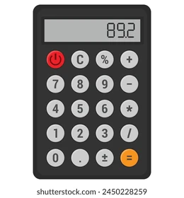

# ps0004 - Simple Calculator

## Required
- To take 2 numbers as operands and a character (`+`, `-`, `*`, `/`, `%`) as an operator and output the result.



- take in consideration bugs & errors, try to fix them and exit the program when bugs occur
- Here are some test cases:
```
Enter the two operands:
8
9

Enter the operator + - * / %:
^

Invalid character for operator.
```
```
Enter the two operands:
8
546

Enter the operator + - * / %:
+

(8) + (546) = 554
```
```
Enter the two operands:
-8
456

Enter the operator + - * / %:
-

(-8) - (456) = -464
```
```
Enter the two operands:
678
8.65

Enter the operator + - * / %:
*

(678) * (8.65) = 5864.7
```
```
Enter the two operands:
97869
3254

Enter the operator + - * / %:
/

(97869) / (3254) = 30.0765
```
```
Enter the two operands:
9
0

Enter the operator + - * / %:
/

Math Error: cannot divide by 0.
```
```
Enter the two operands:
0
0

Enter the operator + - * / %:
/

Infinite number of solutions: (0 / 0) is Undefined Quantity.
```
```
Enter the two operands:
5
2

Enter the operator + - * / %:
%

(5) % (2) = 1
```
```
Enter the two operands:
90.7
67

Enter the operator + - * / %:
%

cannot execute modulo operation for floating point numbers.
```

## Links
[Document link](https://drive.google.com/file/d/1V06Zre1KGzRdR1rFntHDLdWhW3JFGH4y/view?usp=drive_link) for problem story (you can have fun while solving problems 😂)
